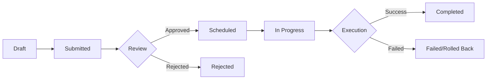

# 🔧 Change Management System

<div align="center">


**A Complete IT Change Management System with Multi-Role Authentication, Approval Workflow, and Comprehensive Audit Trail**

[](https://www.php.net/)
[](https://www.mysql.com/)
[](LICENSE)
[](https://github.com/yourusername/change-management-system/pulls)

[Features](#-features) • [Demo](#-demo) • [Installation](#-installation) • [Usage](#-usage) • [Screenshots](#-screenshots) • [Documentation](#-documentation)

</div>

---

## 📋 Overview

Change Management System adalah aplikasi web berbasis PHP yang dirancang untuk mengelola IT Change Requests dengan sistem approval workflow yang terstruktur. Sistem ini membantu organisasi dalam melacak, mengelola, dan mendokumentasikan setiap perubahan infrastruktur IT dengan akuntabilitas penuh.

### 🎯 Why This System?

- ✅ **Structured Workflow** - Proses approval yang jelas dan terukur
- 🔐 **Role-Based Access** - 4 level user dengan permission berbeda
- 📊 **Complete Audit Trail** - Setiap aktivitas tercatat dengan detail
- 💬 **Collaboration** - Sistem comment dan discussion untuk setiap change
- 🚀 **Easy to Deploy** - Instalasi mudah dengan dokumentasi lengkap
- 📱 **Responsive Design** - Tampilan optimal di desktop dan mobile

---

## ✨ Features

### 🔑 Multi-Role System

<table>
<tr>
<td width="25%">

**👑 Administrator**
- Full system access
- User management
- All change requests
- System configuration
- Audit logs

</td>
<td width="25%">

**📋 Manager**
- Review & approve changes
- Assign to IT staff
- View all changes
- Audit logs
- Performance reports

</td>
<td width="25%">

**🔧 IT Staff**
- Execute assigned changes
- Update progress
- Complete implementations
- Add technical notes
- View assigned tasks

</td>
<td width="25%">

**👤 Client/User**
- Create change requests
- Track own changes
- Add comments
- View status updates
- Submit for approval

</td>
</tr>
</table>

### 🔄 Complete Change Lifecycle



### 🛠️ Core Features

| Feature | Description |
|---------|-------------|
| **Change Request Management** | Create, edit, track, and manage IT change requests |
| **Approval Workflow** | Multi-level approval with comments and feedback |
| **Risk Assessment** | Priority, impact, and risk level classification |
| **Implementation Planning** | Detailed implementation and rollback plans |
| **Scheduling** | Plan maintenance windows and track execution time |
| **Audit Logging** | Complete activity tracking with IP and user agent |
| **Comments System** | Discussion and collaboration on each change |
| **Status Tracking** | Real-time status updates through the lifecycle |
| **Dashboard Analytics** | Statistics and quick insights |
| **User Management** | Create, activate/deactivate users with role assignment |

---

## 🎬 Demo

### Dashboard Overview

*Main dashboard showing change request statistics and recent activities*

### Change Request Detail

*Comprehensive change request view with all technical details*

### Approval Workflow

*Manager reviewing and approving change requests*

### Audit Logs

*Complete activity tracking and filtering*

---

## 🚀 Installation

### Prerequisites

- **Web Server**: Apache 2.4+
- **PHP**: 7.4 or higher
- **Database**: MySQL 5.7+ or MariaDB 10.2+
- **PHP Extensions**: mysqli, pdo_mysql

### Quick Install

```bash
# 1. Clone repository
git clone https://github.com/MfBally354/change-management-system.git
cd change-management-system

# 2. Setup database
mysql -u root -p < database.sql

# 3. Configure database connection
nano config/database.php
# Edit DB_HOST, DB_USER, DB_PASS, DB_NAME

# 4. Set permissions
sudo chown -R www-data:www-data /var/www/change-management
sudo chmod -R 755 /var/www/change-management

# 5. Configure Apache Virtual Host (optional)
sudo nano /etc/apache2/sites-available/change-management.conf
sudo a2ensite change-management
sudo systemctl reload apache2

# 6. Access application
# Open browser: http://localhost/change-management/
```

### Docker Installation (Alternative)

```bash
# Coming soon...
docker-compose up -d
```

### Default Users

| Username | Password | Role | Access Level |
|----------|----------|------|--------------|
| `admin` | `admin123` | Administrator | Full system access |
| `manager1` | `manager123` | Manager | Approve & assign changes |
| `staff1` | `staff123` | IT Staff | Execute changes |
| `client1` | `client123` | Client | Create & track changes |

> ⚠️ **IMPORTANT**: Change all default passwords immediately after first login!

---

## 📖 Usage

### For Users/Clients

1. **Create Change Request**
   - Login → Dashboard → "New Change Request"
   - Fill in details: Title, Description, Category, Priority
   - Add Implementation Plan and Rollback Plan
   - Save as Draft or Submit for Approval

2. **Track Status**
   - View all your changes in Dashboard
   - Check status updates and comments
   - Get notified when status changes

### For Managers

1. **Review & Approve**
   - Dashboard → "Pending Approval"
   - Review technical details and risk assessment
   - Approve and assign to IT Staff, or Reject with comments

2. **Monitor Progress**
   - Track all active changes
   - View audit logs
   - Generate reports

### For IT Staff

1. **Execute Changes**
   - Dashboard → "Your Tasks"
   - Start execution when ready
   - Update progress via comments
   - Mark as complete with completion notes

### For Administrators

1. **User Management**
   - Create new users
   - Assign roles
   - Activate/Deactivate accounts
   - Reset passwords

2. **System Monitoring**
   - View all changes
   - Monitor audit logs
   - System configuration

---

## 🗂️ Project Structure

```
change-management/
├── 📄 index.php              # Dashboard
├── 📄 login.php              # Authentication
├── 📄 logout.php             # Logout handler
├── 📄 database.sql           # Database schema
│
├── ⚙️ config/
│   └── database.php          # DB connection & helpers
│
├── 🔐 auth/
│   └── auth_check.php        # Authentication & authorization
│
├── 📋 changes/               # Change Request module
│   ├── create.php            # Create new change
│   ├── list.php              # List with filters
│   ├── detail.php            # View details
│   ├── approve.php           # Approval workflow
│   ├── execute.php           # Start execution
│   ├── complete.php          # Mark complete
│   └── add_comment.php       # Comment handler
│
├── 📊 logs/
│   └── audit.php             # Audit logs viewer
│
├── 👥 admin/
│   └── users.php             # User management
│
├── 🎨 assets/
│   └── style.css             # Styling
│
└── 📦 includes/
    ├── header.php            # Header template
    └── footer.php            # Footer template
```

---

## 🔐 Security Features

- ✅ **Password Hashing**: bcrypt with `password_hash()`
- ✅ **SQL Injection Prevention**: Prepared statements
- ✅ **XSS Protection**: `htmlspecialchars()` on all outputs
- ✅ **Session Security**: Secure session management
- ✅ **Role-Based Access Control**: Permission checks on every page
- ✅ **Audit Trail**: Complete activity logging with IP tracking
- ✅ **CSRF Protection**: (Recommended to add tokens)

---

## 🎨 Customization

### Change Theme Colors

Edit `assets/style.css`:

```css
/* Main gradient */
background: linear-gradient(135deg, #667eea 0%, #764ba2 100%);

/* Change to your brand colors */
background: linear-gradient(135deg, #YOUR_COLOR_1 0%, #YOUR_COLOR_2 100%);
```

### Add Custom Categories

Edit `database.sql` and `changes/create.php`:

```sql
category ENUM('software', 'hardware', 'network', 'security', 'database', 'cloud', 'other')
```

### Extend Status Workflow

Add new statuses in `config/database.php`:

```php
function getStatusBadge($status) {
    $badges = [
        // ... existing statuses
        'pending_testing' => '<span class="badge badge-warning">Pending Testing</span>',
        'deployed' => '<span class="badge badge-success">Deployed</span>',
    ];
}
```

---

## 📊 Database Schema

### Main Tables

- **users** - User accounts and roles
- **change_requests** - Core change request data
- **change_approvals** - Approval history
- **change_comments** - Comments and discussions
- **audit_logs** - Activity tracking
- **change_attachments** - File uploads (optional)

### Entity Relationship


---

## 🛣️ Roadmap

### Version 2.0 (Planned)

- [ ] 📧 Email notifications
- [ ] 📎 File attachment support
- [ ] 📅 Calendar view for scheduled changes
- [ ] 📈 Advanced analytics dashboard
- [ ] 📱 Progressive Web App (PWA)
- [ ] 🌐 REST API for integrations
- [ ] 📊 Export to PDF/Excel
- [ ] 🔔 Real-time notifications
- [ ] 🌍 Multi-language support
- [ ] 🎨 Theme customization UI

---

## 🐛 Troubleshooting

### Database Connection Failed

```bash
# Check MySQL service
sudo systemctl status mysql

# Test connection
mysql -u root -p

# Verify credentials in config/database.php
```

### Permission Denied

```bash
# Set correct permissions
sudo chown -R www-data:www-data /var/www/change-management
sudo chmod -R 755 /var/www/change-management
```

### Blank Page / PHP Errors

```bash
# Check Apache error log
tail -f /var/log/apache2/error.log

# Enable error display (development only)
# Edit config/database.php:
error_reporting(E_ALL);
ini_set('display_errors', 1);
```

### Forgot Admin Password

```sql
-- Reset to: newpassword123
UPDATE users 
SET password = '$2y$10$92IXUNpkjO0rOQ5byMi.Ye4oKoEa3Ro9llC/.og/at2.uheWG/igi' 
WHERE username = 'admin';
```

---

## 🤝 Contributing

Contributions are welcome! Please feel free to submit a Pull Request.

1. Fork the repository
2. Create your feature branch (`git checkout -b feature/AmazingFeature`)
3. Commit your changes (`git commit -m 'Add some AmazingFeature'`)
4. Push to the branch (`git push origin feature/AmazingFeature`)
5. Open a Pull Request

---

## 📝 License

This project is licensed under the MIT License - see the [LICENSE](LICENSE) file for details.

---

## 👨‍💻 Author

**Your Name**

- GitHub: [MfBally354](https://github.com/MfBally354)
- LinkedIn: [Iqbal Guntur](https://linkedin.com/in/iqbal-guntur-bismoko-29291533a/)
- Email: iqbalguntur

---

## 🙏 Acknowledgments

- Inspired by ITIL Change Management best practices
- Built with modern web technologies
- Community feedback and contributions

---

## 📞 Support

If you have any questions or need help, please:

1. Check the [Documentation](./README.md)
2. Search [existing issues](https://github.com/MfBally354/change-management-system/issues)
3. Create a [new issue](https://github.com/MfBally354/change-management/issues/new)

---

<div align="center">

**⭐ Star this repository if you find it helpful!**

Made with ❤️ by [Iqbal Guntur]

</div>
